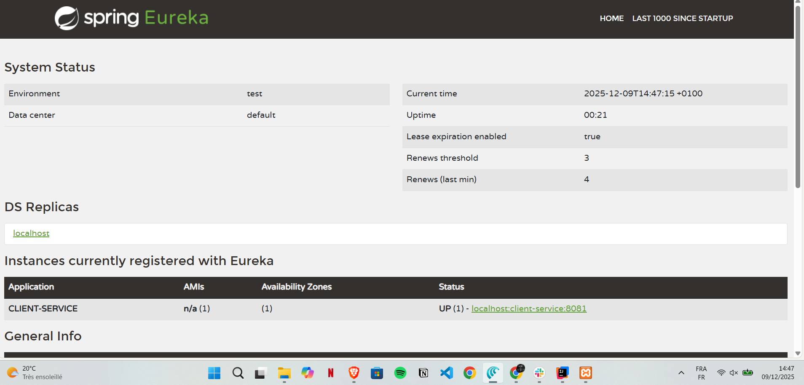

# TP 20 : Architecture Micro-services avec RestTemplate

Ce projet met en œuvre une architecture microservices complète utilisant Spring Boot, Eureka, et Spring Cloud Gateway.

## 📋 Architecture

Le système est composé de :
-   **Eureka Server** (`8761`): Registre de services.
-   **API Gateway** (`8080`): Point d'entrée unique.
-   **Service Client** (`8081`): Gestion des clients.
-   **Service Voiture** (`8082`): Gestion des voitures.

## 📸 Aperçu de l'Application

Voici une capture d'écran illustrant le fonctionnement du projet :

## 🚀 Démarrage

1.  Démarrer **Eureka Server**.
2.  Démarrer **Client Service** et **Voiture Service**.
3.  Démarrer **Gateway Service**.

## 🔗 Accès

-   Portail Eureka : `http://localhost:8761`
-   API Gateway : `http://localhost:8080`
