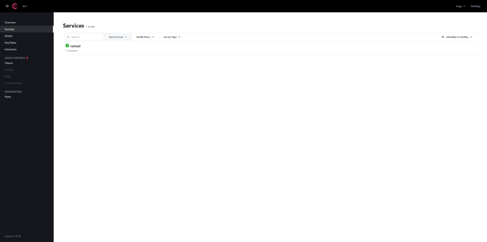

# TP 25: Containerization of Microservices with Docker & Consul

## Objective
Containerize a microservices architecture (Client, Voiture, Gateway) and implement service discovery using Consul, orchestrated via Docker Compose.

## Architecture
-   **Consul**: Service Discovery (Port 8500).
-   **MySQL**: Database (Port 3306).
-   **PHPMyAdmin**: Database Management (Port 8088).
-   **Gateway Service**: Entry point (Port 8888).
-   **Client Service**: Port 8081.
-   **Voiture Service**: Port 8082.

## Prerequisites
-   Docker & Docker Compose installed.

## How to Run
1.  **Build and Start Containers**:
    ```bash
    docker-compose up --build -d
    ```
2.  **Verify Services**:
    -   **Consul Dashboard**: [http://localhost:8500](http://localhost:8500)
    -   **Gateway**: [http://localhost:8888/api/clients](http://localhost:8888/api/clients)
    -   **PHPMyAdmin**: [http://localhost:8088](http://localhost:8088)

## Verification Evidence
### Consul Registration


## Services Configuration
-   **Discovery**: Consul (Replaces Eureka).
-   **Config Import**: `spring.config.import=optional:consul:` added for Spring Boot 3 compatibility.
-   **Base Image**: `eclipse-temurin:17-jdk-alpine` for optimized size.

## Authors
-   Abdelilah Dahou
